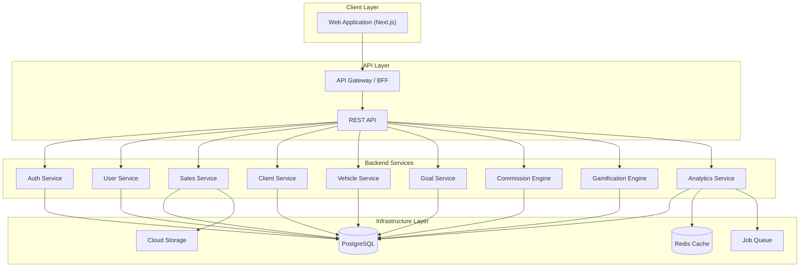
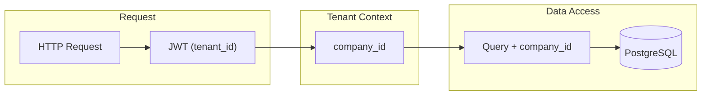

# Mapa de Arquitetura do Sistema — CRM Vendas SaaS

## Modelo formal do sistema

**S = (U, E, R, F, M, A, I)**

| Componente | Descrição |
|------------|-----------|
| **U** | Users (Admin, Salesperson) |
| **E** | Entities (Company, User, Client, Vehicle, Plan, Sale, Activity, Goal, Commission, Achievement, Leaderboard) |
| **R** | Relationships (multi-tenant e domínio) |
| **F** | System Functions (auth, CRUD, cálculos, analytics) |
| **M** | Metrics (revenue, conversion, performance_score, V_seller) |
| **A** | Architecture (camadas e serviços) |
| **I** | Interfaces (Admin + Seller) |

---

## Diagrama de arquitetura em camadas

---

## Fluxo de dados multi-tenant

---

## Responsabilidades por serviço

| Serviço | Responsabilidade | Dependências |
|---------|------------------|--------------|
| **Auth Service** | Login, JWT, refresh, RBAC | users, companies |
| **User Service** | CRUD usuários, perfil, roles | companies |
| **Sales Service** | Vendas, atividades, histórico | clients, vehicles, plans, users |
| **Client Service** | Prospect/Cliente, máscara de dados sensíveis | companies |
| **Vehicle Service** | Cadastro e vínculo de veículos | clients |
| **Goal Service** | Metas, progresso, avaliação | users, sales |
| **Commission Engine** | Regras, cálculo, histórico | sales, plans, config |
| **Gamification Engine** | Achievements, leaderboard, desbloqueios | users, sales, goals |
| **Analytics Service** | Métricas, relatórios, cache | sales, goals, commissions |

---

## Estratégias de escalabilidade (10k companies, 100k users)

| Estratégia | Implementação |
|------------|----------------|
| **Multi-tenant** | `company_id` em todas as tabelas; row-level security (RLS) opcional |
| **Indexação** | Índices em `(company_id, created_at)`, FKs, campos de filtro |
| **Cache** | Redis para rankings, analytics agregados, sessões |
| **Jobs em background** | Fila para: recalcular ranking, comissões em lote, relatórios |
| **Serviços modulares** | Deploy independente, contratos via API REST |

---

## Segurança

- **Autenticação:** JWT (access + refresh), claims: `user_id`, `company_id`, `role`
- **Autorização:** RBAC (Admin vs Salesperson) por rota e recurso
- **Dados sensíveis:** mascaramento de CPF/telefone para vendedor pós-venda; Admin vê tudo
- **Tenant isolation:** toda query filtrada por `company_id` do token
